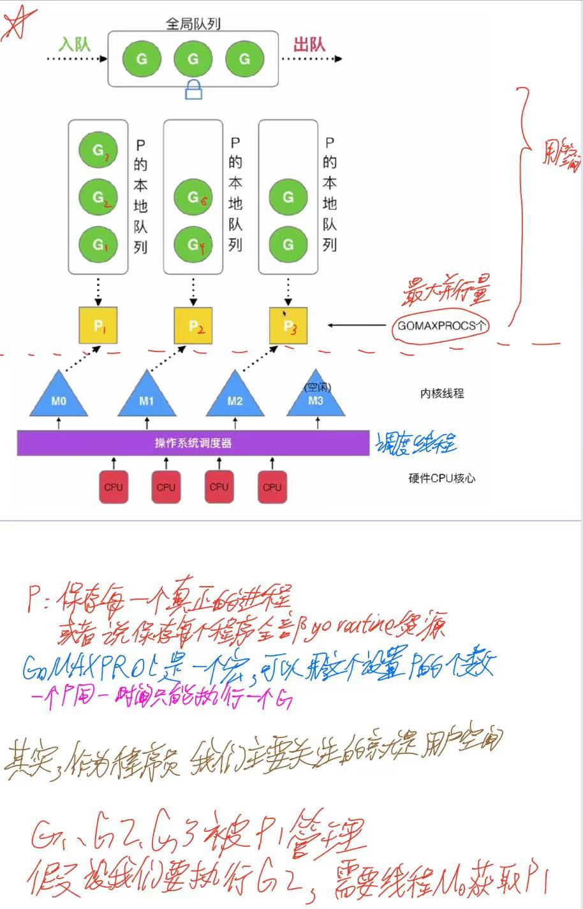

go语言中使用goroutine替换co-routine 
goroutine只有几kb内存占用和栈内存动态伸缩，所以可以轻松创建成千上万个goroutine
1. 大量 
2. 灵活调度（关键，调度器）

结构图： 

全局队列是存放空闲的G，创建的G优先放在P的本地队列中，如果P都满了的话，放入全局队列 

**调度器的设计策略**
1. 复用线程
   - work stealing机制 
   这个的意思就是，如果一个线程的本地队列为空，那么它就会去其他线程的本地队列中偷取任务。 
   - hand off机制
   假设一个线程正在执行的goroutine阻塞了，这样会唤醒或者创建一个新的thread，把当前阻塞的线程中的其他还未执行的goroutine交给新的线程执行。 
   原来的阻塞的goroutine继续阻塞，直到被唤醒。
2. 利用并行
3. 抢占
4. 全局G队列

